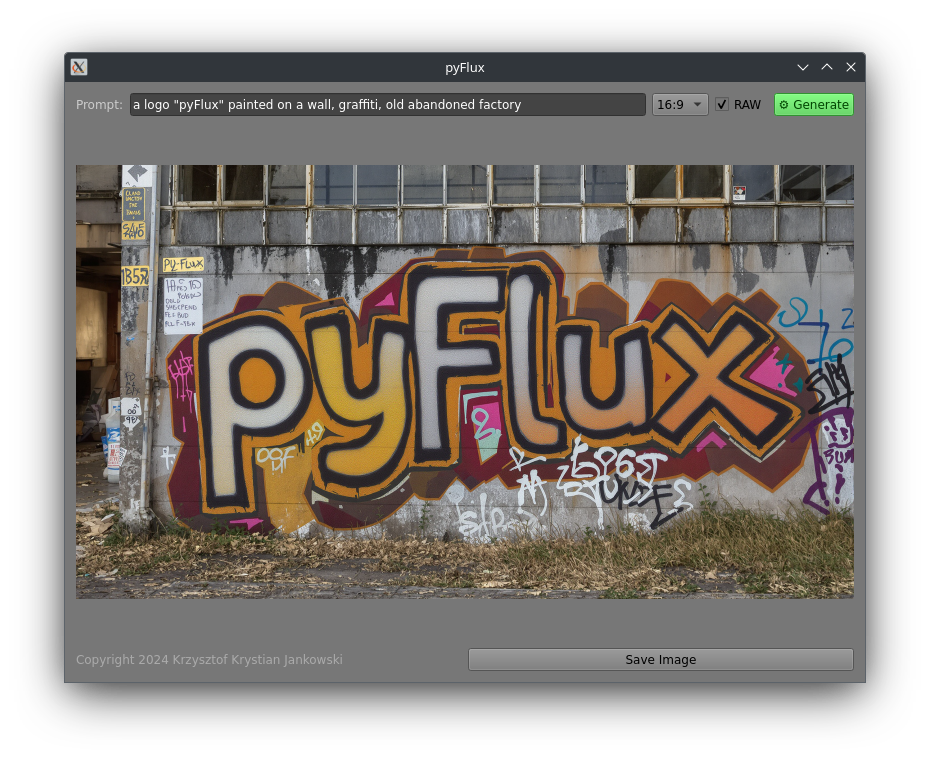

# pyFlux

pyFlux is a PyQt5-based application that allows users to generate images using the [FLUX.1-pro 1.1 Ultra](https://blackforestlabs.io/flux1-1-ultra-and-raw/) from [BlackForestLab](https://blackforestlabs.io/). The application provides a graphical user interface to input prompts, select aspect ratios, and save the generated images.



## Features

- Input prompt for image generation
- Select aspect ratio for the generated image
- Option to generate RAW images
- Automatically save generated images with a timestamp
- Save the last used prompt

## Requirements

- Python 3.x
- PyQt5
- requests

## Installation

1. Clone the repository:
Create a virtual environment and activate it:

   ```sh
   git clone https://github.com/w84death/pyFlux.git
   cd pyFlux```

2. Create a virtual environment and activate it:

```sh
python3 -m venv venv
source venv/bin/activate
```
3. Install the required packages:
pip install requests pyqt5 

## Usage

1. Run the application:

```sh
python app.py
```

2. Enter your BFL API key when prompted. The key will be saved in api-key.txt for future use.

3. Input your prompt, select the desired aspect ratio, and click "Submit" to generate an image.

4. The generated image will be displayed and automatically saved in the outputs directory with a timestamped filename.

## License
This projec
 is licensed under the MIT License. See the [LICENSE](LICENSE) file for details.